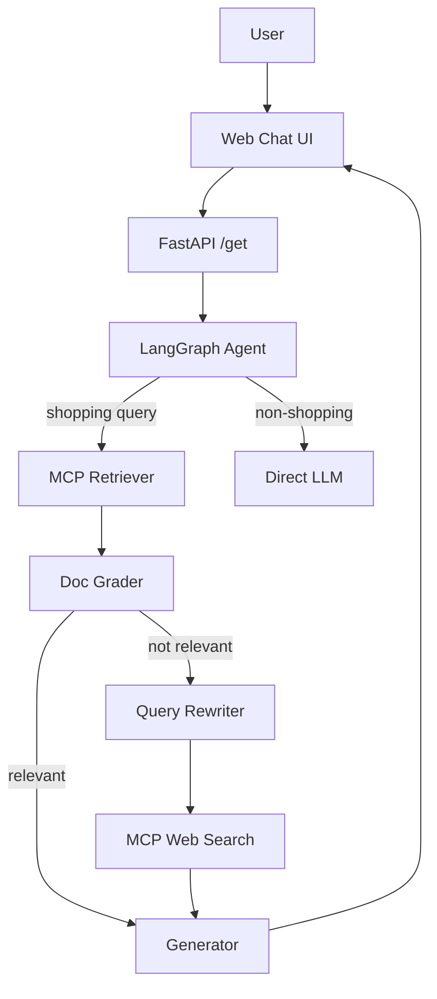

# 🛒 ShopBuddy — Agentic AI Shopping Assistant (RAG + MCP)

ShopBuddy is a **production-grade agentic AI shopping assistant** that answers product-related questions such as prices, reviews, comparisons, and budget recommendations.

It uses a **hybrid Retrieval-Augmented Generation (RAG)** approach:
- First, it retrieves answers from a **local vector database (AstraDB)** built from real product reviews.
- If local data is insufficient or irrelevant, it **automatically falls back to live web search**.

The entire decision-making flow is orchestrated using **LangGraph**, with tool execution handled via **MCP (Model Context Protocol)**.

---

## ✨ Features

- 🔍 **Hybrid RAG System**
  - Local semantic search using AstraDB
  - Web search fallback using DuckDuckGo (via MCP)

- 🧠 **Agentic Workflow (LangGraph)**
  - Query routing
  - Document relevance grading
  - Query rewriting
  - Dynamic tool selection

- 📦 **Real Product Knowledge**
  - Scrapes Flipkart product data and reviews
  - Embeddings generated using HuggingFace models

- 🧾 **Strict Prompt Governance**
  - Plain text responses only
  - INR (₹) currency enforcement
  - Short, buying-focused answers (3–4 sentences)
  - Controlled product comparisons

- 🌐 **Full Stack Application**
  - FastAPI backend
  - Streamlit-based scraping UI
  - HTML/CSS chat interface

- 🚀 **Production Ready**
  - Dockerized
  - CI/CD using GitHub Actions
  - Deployed on AWS EKS + ECR
  - Secrets managed via Kubernetes

---

## LLM + Embeddings
- **LLM Provider**: Groq
- **LLM Model**: `openai/gpt-oss-120b`
- **Embeddings Model**: `sentence-transformers/all-MiniLM-L6-v2`

The LLM is loaded via `prod_assistant/utils/model_loader.py`. Embeddings are used for AstraDB vector retrieval, followed by contextual compression and relevance grading.

## Architecture (Overview)


## MCP Tooling
- MCP Server: `prod_assistant/mcp_servers/product_search_saver.py`
- MCP Port: `8001` (FastAPI uses `8000`)
- Tools:
  - `get_product_info` → AstraDB
  - `web_search` → DuckDuckGo

## Project Structure
```
.
├── .github/
│   └── workflows/
│       ├── deploy.yml
│       └── infra.yml
├── infra/
│   └── eks-with-ecr.yaml
├── k8/
│   ├── deployment.yaml
│   └── service.yaml
├── prod_assistant/
│   ├── config/
│   ├── evaluation/
│   ├── mcp_servers/
│   ├── prompt_library/
│   ├── retriever/
│   ├── router/
│   ├── utils/
│   └── workflow/
├── static/
├── templates/
├── Dockerfile
├── requirements.txt
└── README.md
```

## Local Setup
### 1) Install dependencies
```bash
pip install -r requirements.txt
```

### 2) Environment variables
Create a `.env` with the required keys:
```
OPENAI_API_KEY=
GOOGLE_API_KEY=
GROQ_API_KEY=
ASTRA_DB_API_ENDPOINT=
ASTRA_DB_APPLICATION_TOKEN=
ASTRA_DB_KEYSPACE=
```

### 3) Run MCP server (separate process)
```bash
python -m prod_assistant.mcp_servers.product_search_saver
```

### 4) Run API server
```bash
uvicorn prod_assistant.router.main:app --host 0.0.0.0 --port 8000 --workers 2
```

## Deployment (AWS EKS)
- Provision infra: `.github/workflows/infra.yml`
- Deploy app: `.github/workflows/deploy.yml`

High-level deployment flow:
1. Build + push Docker image to ECR
2. Apply K8s manifests from `k8/`
3. Patch deployment with image tag
4. Verify rollout

## Configuration Notes
- AstraDB keyspace and collection are auto-initialized on first run.
- If Groq is disabled or missing, the app will fail unless you modify `model_loader` to fall back to OpenAI only.

## 🧠 Why This Project Matters
This project demonstrates:

- Real-world RAG architecture
- Agentic decision-making
- Tool-based LLM systems (MCP)
- Production deployment skills
- Strong prompt & output control

It’s not just a chatbot — it’s a scalable AI system.

## 📌 Future Improvements
- Price tracking over time
- Multi-store scraping (Amazon, Myntra)
- User preference memory
- Comparison-only agent
- Observability & tracing

## 👨‍💻 Author
**NIRAJ KUMAR**  
AI / ML Engineer  
Focused on Agentic AI, RAG systems, and production-grade LLM applications.

## Troubleshooting
- **Rollout timeout**: check node disk and pod events, then re-run deploy
- **GROQ_API_KEY missing**: ensure it exists in both Kubernetes secret and deployment env
- **MCP port conflict**: MCP runs on `8001`, FastAPI runs on `8000`

## License
MIT
