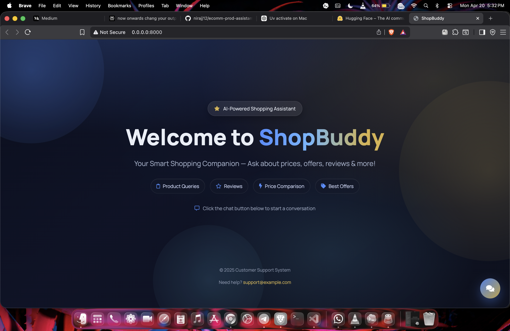
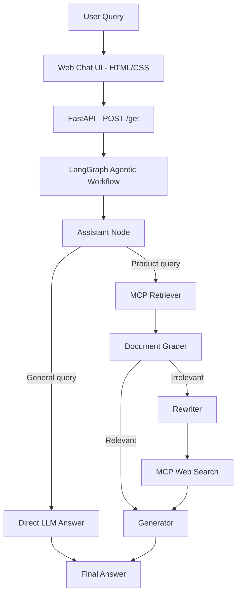

# 🛒 ShopBuddy — Agentic RAG E-commerce Assistant

> A production-grade AI-powered shopping assistant that answers product queries using a hybrid RAG pipeline, Agentic LangGraph workflow, MCP-based tool orchestration, and AWS EKS deployment.


ShopBuddy combines retrieval, grading, rewriting, and tool-based fallback into a single deployable shopping assistant designed for practical product discovery workflows.

---

## 📌 Table of Contents

- [Overview](#-overview)
- [Project Preview](#-project-preview)
- [Features](#-features)
- [System Architecture](#-system-architecture)
- [Agentic Workflow](#-agentic-workflow)
- [Project Structure](#-project-structure)
- [Tech Stack](#-tech-stack)
- [Environment Variables](#-environment-variables)
- [Local Setup](#-local-setup)
- [Data Pipeline (ETL)](#-data-pipeline-etl)
- [MCP Server](#-mcp-server)
- [RAGAS Evaluation](#-ragas-evaluation)
- [Docker](#-docker)
- [CI/CD and AWS EKS Deployment](#-cicd-and-aws-eks-deployment)
- [API Endpoints](#-api-endpoints)
- [Known Limitations](#-known-limitations)
- [Future Improvements](#-future-improvements)
- [Author](#-author)

---

## 📖 Overview

**ShopBuddy** is a production-grade Agentic RAG assistant for e-commerce product queries. A user asks something like *"What is the best phone under ₹30,000?"* and the system:

1. Detects that it is a product-related query.
2. Fetches semantically relevant products from **AstraDB vector store** using MMR search + LLM-based contextual compression.
3. **Grades** the retrieved documents for relevance.
4. If documents are relevant → generates the answer.
5. If documents are irrelevant → **rewrites the query** and falls back to **DuckDuckGo web search** via MCP.
6. Returns a clean, plain-text shopping answer.

Rather than acting like a basic chat interface, ShopBuddy behaves as a multi-step decision system with retrieval, verification, fallback search, and answer generation stages.

---

## 🖼️ Project Preview

The project includes a polished browser-based chat interface for interacting with the assistant locally or in deployment.



The system architecture and workflow are documented below using embedded diagrams so the README stays self-contained and GitHub-friendly.

---

## ✨ Features

- 🔍 **Hybrid RAG** — AstraDB vector search + web search fallback
- 🧠 **Agentic Workflow** — LangGraph-based multi-node decision graph
- 🛠️ **MCP Tool Orchestration** — Model Context Protocol for tool calling
- 📊 **RAGAS Evaluation** — Context precision and response relevancy scoring
- 🔄 **Query Rewriting** — Automatic query improvement when retrieval fails
- 📦 **ETL Pipeline** — Selenium-based Flipkart scraper + AstraDB ingestion
- 🌐 **Full Stack** — FastAPI backend + HTML/CSS chat UI
- 🐳 **Dockerized** — Single container runs both MCP server and FastAPI
- 🚀 **AWS EKS Deployed** — Kubernetes deployment with CI/CD via GitHub Actions

---

## 🏗️ System Architecture

The application has two major flows:
- **Offline data pipeline** for scraping, transforming, embedding, and indexing product review data in AstraDB
- **Online query pipeline** for routing user questions through retrieval, grading, rewriting, web search fallback, and final answer generation


```mermaid
flowchart TD
    U["User Query"]
    UI["Web Chat UI - HTML/CSS"]
    API["FastAPI - POST /get"]
    AG["LangGraph Agentic Workflow"]
    A["Assistant Node"]
    R["MCP Retriever"]
    DG["Document Grader"]
    G["Generator"]
    RW["Rewriter"]
    WS["MCP Web Search"]
    DL["Direct LLM Answer"]
    F["Final Answer"]

    U --> UI --> API --> AG --> A
    A -->|"Product query"| R
    A -->|"General query"| DL --> F
    R --> DG
    DG -->|"Relevant"| G
    DG -->|"Irrelevant"| RW --> WS --> G
    G --> F
```

```text
User Query
    |
    v
[Web Chat UI - HTML/CSS]
    |
    v
[FastAPI - POST /get]
    |
    v
[LangGraph Agentic Workflow]
    |
    +--> [Assistant Node]
            |
       (product query?)
            |
       YES  v           NO
       [MCP Retriever]-----> [Direct LLM Answer]
            |
            v
       [Document Grader]
            |
       RELEVANT?
       YES  |   NO
            v    v
      [Generator] [Rewriter]
            |         |
            |    [MCP Web Search]
            |         |
            v         v
          [Generator Node]
                 |
                 v
          Final Answer -> User
```

---

## 🔄 Agentic Workflow

The entire workflow is defined in `prod_assistant/workflow/agentic_workflow_with_mcp_websearch.py` using **LangGraph StateGraph**.

### Nodes

| Node | Role |
|---|---|
| `Assistant` | Routes query — product-related goes to Retriever, everything else answered directly by LLM |
| `Retriever` | Calls MCP tool `get_product_info` to fetch context from AstraDB |
| `Grader` | LLM checks if retrieved docs are relevant to the question |
| `Generator` | Combines context + question and generates final product answer |
| `Rewriter` | If grader says irrelevant, LLM rewrites the query to be clearer |
| `WebSearch` | Calls MCP tool `web_search` using DuckDuckGo as fallback |

### Workflow Edges

```text
START -> Assistant
Assistant -> Retriever (if product query)
Assistant -> END (if general query, answered directly)
Retriever -> Grader
Grader -> Generator (if relevant)
Grader -> Rewriter (if not relevant)
Rewriter -> WebSearch
WebSearch -> Generator
Generator -> END
```

### Retriever Design

The retriever uses a **two-step approach** for quality:
1. **MMR Search** from AstraDB (`fetch_k=25`, `k=4`, `lambda_mult=0.6`, `score_threshold=0.3`) — balances relevance and diversity.
2. **LLM Contextual Compression** using `LLMChainFilter` — filters out irrelevant documents before generation.

These values are driven by the retriever implementation and `prod_assistant/config/config.yaml`.

---

## 📁 Project Structure

```text
ecomm-prod-assistant/
|
|-- .github/
|   `-- workflows/
|       |-- deploy.yml              # CI/CD: build -> ECR -> EKS deploy
|       `-- infra.yml               # Provision AWS EKS infrastructure
|
|-- infra/
|   `-- eks-with-ecr.yaml           # EKS cluster + ECR setup config
|
|-- k8/
|   |-- deployment.yaml             # Kubernetes Deployment manifest
|   `-- service.yaml                # Kubernetes Service (LoadBalancer)
|
|-- prod_assistant/
|   |-- config/                     # YAML config files (AstraDB collection, retriever params)
|   |-- etl/
|   |   |-- data_scraper.py         # Selenium-based Flipkart scraper
|   |   `-- data_ingestion.py       # CSV -> LangChain Documents -> AstraDB
|   |-- evaluation/
|   |   `-- ragas_eval.py           # RAGAS context precision + response relevancy
|   |-- exception/                  # Custom exception handling
|   |-- logger/                     # Structured logging (structlog)
|   |-- mcp_servers/
|   |   |-- client.py               # MCP client setup
|   |   `-- product_search_saver.py # MCP server: get_product_info + web_search tools
|   |-- prompt_library/
|   |   `-- prompts.py              # PROMPT_REGISTRY - centralized prompt templates
|   |-- retriever/
|   |   `-- retrieval.py            # AstraDB MMR retriever + LLM compression
|   |-- router/
|   |   `-- main.py                 # FastAPI app with all endpoints
|   |-- utils/
|   |   |-- model_loader.py         # LLM + Embeddings loader
|   |   `-- config_loader.py        # YAML config loader
|   `-- workflow/
|       `-- agentic_workflow_with_mcp_websearch.py  # LangGraph agentic pipeline
|
|-- data/
|   `-- product_reviews.csv         # Scraped Flipkart product data
|
|-- notebook/                       # Experimental/exploration notebooks
|-- static/                         # CSS and JS for chat UI
|-- templates/
|   `-- chat.html                   # Chat UI HTML template
|-- test/                           # Unit and integration tests
|-- docs/
|   `-- images/
|       `-- shopbuddy-ui.png        # README UI preview screenshot
|
|-- scrapper_ui.py                  # Streamlit UI for running the scraper
|-- main.py                         # Entry point
|-- Dockerfile                      # Docker build config
|-- .dockerignore
|-- .env.copy                       # Template for required environment variables
|-- .gitignore
|-- pyproject.toml
|-- requirements.txt
`-- README.md
```

---

## 🛠️ Tech Stack

| Category | Technology |
|---|---|
| Language | Python 3.11 |
| API Framework | FastAPI 0.116.1 + Uvicorn 0.35.0 |
| Agentic Workflow | LangGraph 0.6.7 |
| LLM Framework | LangChain 0.3.27 |
| Default LLM Provider | Groq (`openai/gpt-oss-120b`) |
| Embeddings | HuggingFace `sentence-transformers/all-MiniLM-L6-v2` |
| Vector Database | AstraDB (Cassandra-backed) |
| Tool Orchestration | MCP (Model Context Protocol) |
| Web Search | DuckDuckGo via `langchain_community` |
| Data Scraping | Selenium + undetected-chromedriver + BeautifulSoup |
| Evaluation | RAGAS 0.3.4 |
| Containerization | Docker |
| Orchestration | Kubernetes (AWS EKS) |
| CI/CD | GitHub Actions |
| Image Registry | AWS ECR |
| UI | HTML, CSS, Jinja2 templates |
| Scraper UI | Streamlit |

---

## 🔐 Environment Variables

Copy `.env.copy` to `.env` and fill in all values:

```env
GROQ_API_KEY=your_groq_api_key
GOOGLE_API_KEY=your_google_api_key
OPENAI_API_KEY=your_openai_api_key
ASTRA_DB_API_ENDPOINT=https://your-astra-db-endpoint
ASTRA_DB_APPLICATION_TOKEN=AstraCS:your_token
ASTRA_DB_KEYSPACE=default_keyspace
# Optional: override configured provider
LLM_PROVIDER=groq
```

| Variable | Purpose |
|---|---|
| `GROQ_API_KEY` | LLM inference via Groq |
| `GOOGLE_API_KEY` | Google Generative AI (fallback or embeddings) |
| `OPENAI_API_KEY` | OpenAI (fallback model support) |
| `ASTRA_DB_API_ENDPOINT` | AstraDB REST API endpoint |
| `ASTRA_DB_APPLICATION_TOKEN` | AstraDB authentication token |
| `ASTRA_DB_KEYSPACE` | AstraDB keyspace name |
| `LLM_PROVIDER` | Optional provider selector (`groq`, `google`, or `openai`), defaults to `groq` |

---

## 💻 Local Setup

### Prerequisites

- Python 3.11+
- pip or uv
- Chrome browser (for Selenium scraper)
- AstraDB account ([datastax.com](https://www.datastax.com/))
- Groq API key ([console.groq.com](https://console.groq.com/))

### Step 1 - Clone the repo

```bash
git clone https://github.com/nirajj12/ecomm-prod-assistant.git
cd ecomm-prod-assistant
```

### Step 2 - Create virtual environment

```bash
python -m venv venv
source venv/bin/activate       # Linux/Mac
venv\Scripts\activate          # Windows
```

### Step 3 - Install dependencies

```bash
pip install -r requirements.txt
```

### Step 4 - Set up environment variables

```bash
cp .env.copy .env
# Now open .env and fill in all values
```

### Step 5 - Run the data pipeline (first time only)

Scrape product data and ingest into AstraDB:

```bash
# Option 1: Run scraper directly
python -m prod_assistant.etl.data_scraper

# Option 2: Use Streamlit UI
streamlit run scrapper_ui.py

# Ingest scraped CSV into AstraDB
python -m prod_assistant.etl.data_ingestion
```

### Step 6 - Start MCP server (Terminal 1)

```bash
python -m prod_assistant.mcp_servers.product_search_saver
# Runs on http://localhost:8001/mcp
```

### Step 7 - Start FastAPI server (Terminal 2)

```bash
uvicorn prod_assistant.router.main:app --host 0.0.0.0 --port 8000 --reload
```

### Step 8 - Open the chat UI

```text
http://localhost:8000
```

---

## 📦 Data Pipeline (ETL)

The ETL pipeline lives in `prod_assistant/etl/` and has two stages:

### Stage 1 - Scraping (`data_scraper.py`)

- Uses **Selenium + undetected-chromedriver** to scrape Flipkart product pages.
- Collects: `product_id`, `product_title`, `price`, `rating`, `total_reviews`, `top_reviews`.
- Saves data to `data/product_reviews.csv`.

### Stage 2 - Ingestion (`data_ingestion.py`)

- Reads the CSV and transforms each row into a **LangChain `Document`** object.
- Each document has:
  - **content**: product summary text used for semantic retrieval
  - **metadata**: product fields such as title, price, and rating for formatting and display
- Embeds documents using HuggingFace `all-MiniLM-L6-v2` and stores them in **AstraDB vector store**.

---

## 🔌 MCP Server

The MCP server runs at `http://localhost:8001/mcp` and exposes two tools:

| Tool | Description |
|---|---|
| `get_product_info(query)` | Fetches relevant product context from AstraDB using the retriever |
| `web_search(query)` | Searches the web via DuckDuckGo when local data is insufficient |

The server is defined in `prod_assistant/mcp_servers/product_search_saver.py` using `FastMCP`.

> ⚠️ **Important**: MCP server runs on port `8001`. FastAPI runs on port `8000`. Never run both on the same port.

---

## 📊 RAGAS Evaluation

The project uses **RAGAS** to evaluate retrieval and generation quality.

Two metrics are measured:

| Metric | What it measures |
|---|---|
| `Context Precision` | How precise the retrieved context is relative to the query |
| `Response Relevancy` | How relevant the generated answer is to the original question |

Run evaluation manually:

```bash
python -m prod_assistant.retriever.retrieval
```

The script prints both scores to the console. Scores range from `0` to `1`, where higher is better.

---

## 🐳 Docker

### Build image

```bash
docker build -t shopbuddy:latest .
```

### Run container

```bash
docker run -p 8000:8000 --env-file .env shopbuddy:latest
```

The Docker container automatically starts both:
- MCP server on port `8001`
- FastAPI server on port `8000`

Only port `8000` is published in the sample command because the browser UI talks to FastAPI, and FastAPI communicates with the MCP server internally inside the same container.

This is handled by the `CMD` in `Dockerfile`:

```bash
PORT=8001 MCP_PORT=8001 python -m prod_assistant.mcp_servers.product_search_saver &
uvicorn prod_assistant.router.main:app --host 0.0.0.0 --port 8000 --workers 2
```

---

## 🚀 CI/CD and AWS EKS Deployment

### Infrastructure Provisioning

`.github/workflows/infra.yml` is a manually triggered workflow that provisions the base AWS infrastructure using `infra/eks-with-ecr.yaml`.

### Application Deployment

`.github/workflows/deploy.yml` runs on every push to `main` and can also be triggered manually:

1. Build Docker image.
2. Push image to **AWS ECR**.
3. Update Kubernetes deployment with new image tag.
4. Apply manifests from `k8/` (deployment + service).
5. Verify rollout success.

### Kubernetes Setup

| File | Purpose |
|---|---|
| `k8/deployment.yaml` | Defines pods, replicas, image, env vars, resource limits |
| `k8/service.yaml` | Exposes the app via LoadBalancer on port 80 -> 8000 |

---

## 📡 API Endpoints

| Method | Endpoint | Description |
|---|---|---|
| `GET` | `/` | Serves the chat UI |
| `GET` | `/status` | Returns deployment status |
| `GET` | `/health` | Health check ping |
| `POST` | `/get` | Accepts user message, returns AI answer |

### Example

```bash
curl -X POST http://localhost:8000/get \
  -F "msg=What is the best phone under 30000?"
```

---

## ⚠️ Known Limitations

- `AgenticRAG()` is instantiated per request in `/get` endpoint - this is inefficient and should be moved to a startup singleton.
- Keyword-based routing in the `Assistant` node is brittle - a better approach is LLM-based intent classification.
- MCP client initialization happens during agent construction, which increases per-request overhead in the current FastAPI setup.
- No rate limiting or request validation on the FastAPI layer.
- `MemorySaver` checkpointer accumulates in memory with no session cleanup for long-running deployments.
- Scraper depends on Flipkart's HTML structure, which may change over time.

---

## 🔮 Future Improvements

- [ ] Move `AgenticRAG` to FastAPI `lifespan` startup for better performance
- [ ] Replace keyword routing with LLM-based intent classifier
- [ ] Add price tracking over time per product
- [ ] Expand scraper to Amazon and Myntra
- [ ] Add user preference memory using session store
- [ ] Add structured logging + observability with OpenTelemetry
- [ ] Add product comparison mode as a dedicated agent
- [ ] Add unit tests and integration tests in `test/` folder

---

## 👨‍💻 Author

**Niraj Kumar**
AI/ML Engineer Intern | B.Tech CSE, Sikkim Manipal Institute of Technology

- 🔗 [GitHub](https://github.com/nirajj12)
- 💼 [LinkedIn](https://www.linkedin.com/in/niraj-kumar)

---

## 📄 License

This project is licensed under the [MIT License](LICENSE).
